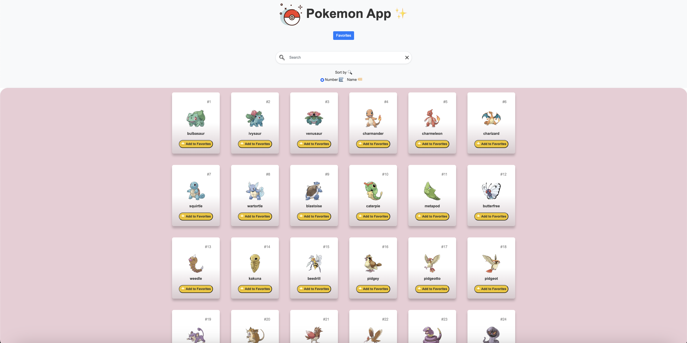
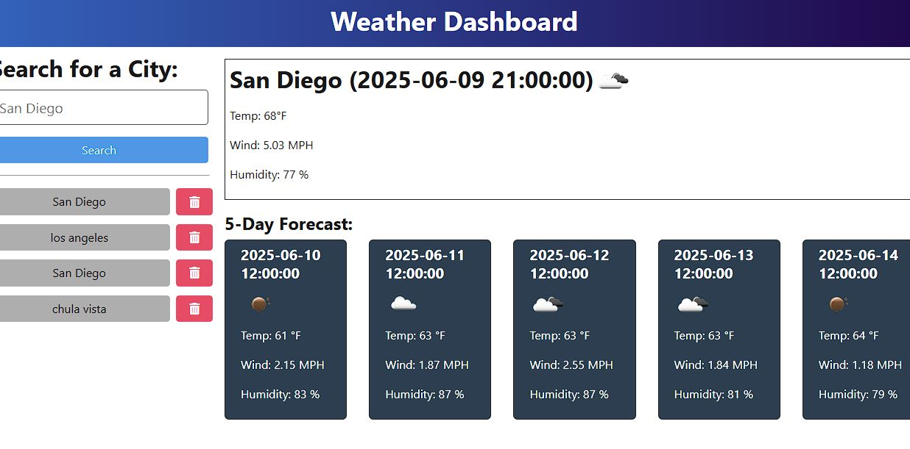
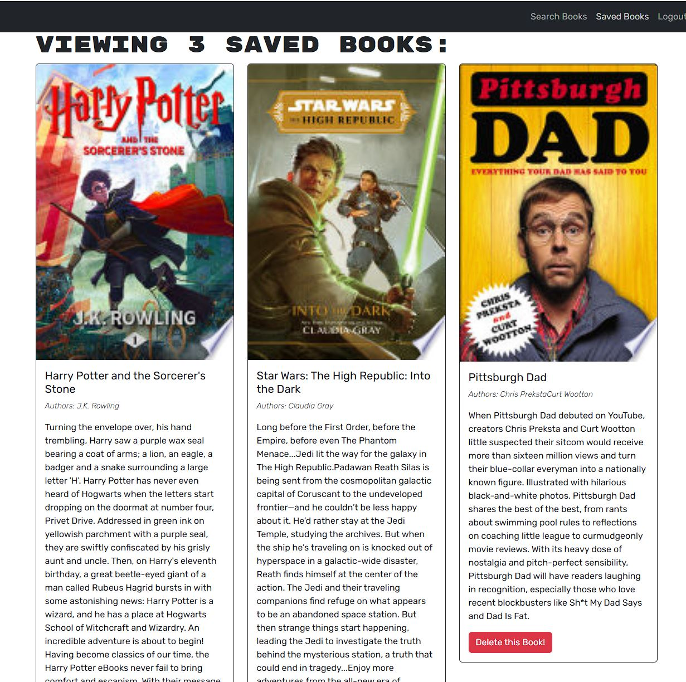

# React Portfolio

A modern, responsive developer portfolio built with React and Vite. This project showcases my skills, experience, and featured projects, providing an interactive and visually appealing way for visitors to learn more about me and my work.

## Table of Contents

- [Features](#features)
- [Screenshots](#screenshots)
- [Getting Started](#getting-started)
- [Project Structure](#project-structure)
- [Technologies Used](#technologies-used)
- [Projects](#projects)
- [Contact](#contact)
- [License](#license)

## Features

- Responsive design for desktop and mobile
- Animated backgrounds and theme toggle
- About, Skills, Projects, and Contact sections
- Featured projects with links to live demos and GitHub repositories
- Clean, modern UI with custom color palette

## Screenshots





## Getting Started

1. **Clone the repository:**
   ```sh
   git clone https://github.com/AdrewReyes/Portfolio
   cd your-portfolio-repo